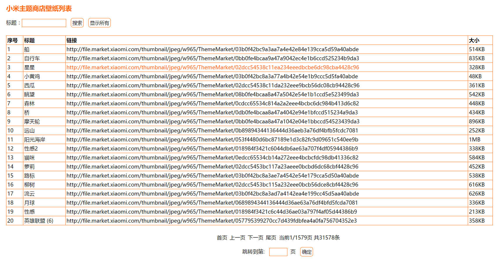

#python爬虫数据保存到数据库并展示

python从网上爬取数据后结果保存到文本文件中，然后从文本文件导入到mysql数据库中，最后用php展示出来。

## 1. pathon爬虫文件 spider.py

```
#!/usr/bin/env python
# -*- coding:utf-8 -*-

"""
程序说明:
从http://zhuti.xiaomi.com/wallpaper上下载壁纸

小米主题商店api接口地址;
http://zhuti.xiaomi.com/wallpaper?page=1&sort=New&ajax=1&count=30&act=list&keywords=&subjectId=
http://zhuti.xiaomi.com/wallpaper?page=1&sort=New&ajax=1&count=30&act=search&keywords=小黄人 #搜索壁纸关键子"小黄人"(返回json) ,当act=search时keywords有效,page、count无效
http://zhuti.xiaomi.com/wallpaper?page=1&sort=New&ajax=1&count=30&act=list&keywords= #壁纸索引页(返回json),当act=list或home时,page有效,keywords无效
http://zhuti.xiaomi.com/wallpaper?page=1&sort=New&ajax=1&count=30&act=host&keywords= #壁纸索引页(返回html),当act=host时，ajax、count、keywords无效，返回壁纸索引页html页面
http://zhuti.xiaomi.com/wallpaper?page=1&sort=New #壁纸索引页html

小米主题商店api接口参数说明:
page: 页数(取值范围[1-2304])
sort: 排序方式(取值[New|Hot])([New:按时间排序|Hot:按热度排序])
ajax: 是否允许ajax(取值[0|1])([0:不允许]|[1:允许])
count: 每一页显示的记录数(当page=1时count取值范围[1-69060])(总记录数30*2303=69090)
act: 查询动作(取值[home|host|list|search])([home:主页|host:主机|list:列表|search:搜索])
keywords: 查询关键字(取值[有效字符串])
subjectId: 目标ID(取值[未知])(不知道这个参数有啥用)

返回结果为json格式,以下是部分返回结果:
[{
"assemblyId": "633e4d93-64cf-4139-b91e-fefafd16656f", #集合Id
"downloadUrlRoot": "http://t3.market.mi-img.com/thumbnail/", #壁纸下载url根
"fileSize": 583625, #文件大小
"frontCover": "ThemeMarket/0ef3cd436bfde45073621a0f1a8c4ff97a6d22d19", #封面url(壁纸地址)
"moduleId": "74d72424-b811-4d16-9543-55857b31ebe9", #模块Id
"name": "小黄人", #壁纸名字
}]

壁纸地址:
http://file.market.xiaomi.com/thumbnail/jpeg/h160/ThemeMarket/0ef3cd436bfde45073621a0f1a8c4ff97a6d22d19 缩略图地址
http://file.market.xiaomi.com/thumbnail/jpeg/w965/ThemeMarket/0ef3cd436bfde45073621a0f1a8c4ff97a6d22d19 壁纸地址
"""

#导入需要用到的模块
import urllib,urllib2,socket,re,sys,os,platform,time

#设置字符集
reload(sys)
sys.setdefaultencoding('utf-8')

#设置请求超时时间(秒)
timeout = 60
socket.setdefaulttimeout(timeout)

#获取操作系统类型
OS = platform.platform()

#获取当前目录
PWD = os.getcwd()

#请求头信息，模拟浏览器请求，防止反爬虫
headerrs = {
    'User-Agent': 'Mozilla/5.0 (Windows NT 6.1; Win64; x64; rv:53.0) Gecko/20100101 Firefox/53.0'
    }

#定义壁纸保存目录
if "Windows" in OS: #判断是不是windows系统
    wallpaperDir = "%s\\image\\" % PWD #壁纸
else :
    wallpaperDir = "%s/image/" % PWD

#判断保存壁纸的文件夹是否存在，不存在则创建
def makeDir():
    if os.path.exists(wallpaperDir):
        pass
    else:
        os.makedirs(wallpaperDir) #创建保存壁纸的目录

#采用urllib.urlretrieve()方法下载壁纸
def autoDown(picURL,filePath):#传入壁纸url和保存的文件路径
    try:
        if os.path.exists(filePath):
            pass
        else:
            urllib.urlretrieve(picURL, filePath)
            time.sleep(3) #下载完一张壁纸暂停3秒,等待壁纸加载完成
    except urllib.ContentTooShortError: #防止壁纸下载不完全
        # print u"网络不稳定，重试..."
        os.remove(filePath)
        autoDown(picURL,filePath)
    except IOError,e:
        # print u"出错了，出错信息 %s" % e
        pass

#字节Bytes换算成KB/MB/GB
def formatSize(Bytes):
    try:
        Bytes = int(Bytes)
        KB = Bytes / 1024
    except:
        print u"传入的字节格式不对"
    if KB >= 1024:
        MB = KB / 1024
        if MB >= 1024:
            GB = MB / 1024
            return "%dGB" % GB
        else:
            return "%dMB" % MB
    else:
        return "%dKB" % KB

#小米主题商店壁纸搜索页api,搜索关键字返回json结果
def getSearchJson(keywords): #传入搜索关键字
    baseurl = u"http://zhuti.xiaomi.com/wallpaper?page=1&sort=New&ajax=1&act=search"
    queryString = u"&keywords=%s" % (keywords)
    queryURL =  baseurl + queryString
    request = urllib2.Request(queryURL) #请求
    response = urllib2.urlopen(request,timeout=timeout) #响应,超时时间60秒
    json =  response.read() #页面返回json
    return json

#小米主题商店壁纸索引页api,返回json结果
def getIndexJson(pageNumber, countNumber): #传入页数和每一页记录数
    baseurl = u"http://zhuti.xiaomi.com/wallpaper?sort=New&ajax=1&act=list&keywords="
    queryString = u"&page=%s&count=%s" % (pageNumber, countNumber)
    queryURL =  baseurl + queryString
    # print u"请求url地址: %s\n" % queryURL
    request = urllib2.Request(queryURL) #请求
    response = urllib2.urlopen(request,timeout=timeout) #响应,超时时间60秒
    json =  response.read() #页面返回json
    return json

#下载壁纸
def getWallpaper(pageNumber, countNumber):#传入页数和每一页记录数
    try:
        #壁纸地址 : http://file.market.xiaomi.com/thumbnail/jpeg/w965/ThemeMarket/0ef3cd436bfde45073621a0f1a8c4ff97a6d22d19
        global snNumber #声明全局变量 壁纸编号
        snNumber = 0 #壁纸编号
        json = getIndexJson(pageNumber, countNumber) #返回json结果列表
        #正则匹配壁纸下载url根、封面url、壁纸名称
        reg = re.compile(r'"assemblyId":".*?","downloadUrlRoot":"(.*?)",.*?"fileSize":.*?,"frontCover":"(.*?)",.*?"moduleId":".*?",.*?"name":"(.*?)"',re.S) #re.S: 匹配换行
        itemlist = re.findall(reg,json) #壁纸下载url根、封面url、壁纸名称列表 [('http://t4.market.mi-img.com/thumbnail/', 'ThemeMarket/03b0f42bc9a3aa7a4e42e84e139cca5d59a40abde', '\xe8\x88\xb9')]
        print u"\n"
        print u"第 %s 页:" % pageNumber
        for downloadUrlRoot, frontCover, name in itemlist:
            snNumber = snNumber + 1 #壁纸编号+1
            wallpaperURL = u'http://file.market.xiaomi.com/thumbnail/jpeg/w965/%s' % frontCover #壁纸地址
            prewallpaperName = frontCover[12:] + '.jpg' #拼接文件名03b0f42bc9a3aa7a4e42e84e139cca5d59a40abde.jpg
            wallpaperName = re.sub("[?=&]+","",prewallpaperName).decode("gbk")# 过滤特殊字符"?"、"="、"&",并转换编码为gbk,保证中文文件名保存不出错
            wallpaperPath = wallpaperDir + wallpaperName #拼接保存文件全路径 D:\python\xmpic\image\wallpaper\03b0f42bc9a3aa7a4e42e84e139cca5d59a40abde.jpg
            autoDown(wallpaperURL, wallpaperPath) #调用autoDown()方法下载壁纸
            size = os.path.getsize(wallpaperPath) #获取文件大小(Bytes)
            fileSize =  formatSize(size) #格式化文件大小(KB,MB)
            print u"保存第 %s 张壁纸 %s 到 %s 壁纸大小 \033[0;32m%s\033[0m 壁纸名称 \033[0;32m%s\033[0m" % (snNumber, wallpaperURL, wallpaperPath, fileSize, name)
            print >> logfile,u"%s\t%s\t%s\t%s" % (wallpaperURL, wallpaperPath, fileSize, name)
    #捕捉并处理异常
    except socket.error,e:
        print u"\033[0;31m下载出错: %s \033[0m" % e

if __name__ == "__main__":
    print u"从小米主题商店下载壁纸:\n"
    # print getIndexJson(1,1) #查询第1页，每页显示3条记录
    # print getSearchJson(u"小黄人")
    # getWallpaper(1,3) #下载第一页，每页显示5条记录
    logfile = open('log.txt', 'w+') #打开文件写入日志
    totalPage = 2303 #总数20页
    countNumber = 30 #每页30条记录
    for pageNumber in range(1, totalPage + 1):
        getWallpaper(pageNumber, countNumber)
    logfile.close() #关闭文件
    totalFile = totalPage * countNumber #文件总数
    print u"\n"
    print u"一共下载了 %s 张图片" % totalFile
    if "Windows" in OS:
        print u"日志文件路径 %s\\log.txt" % PWD
    else:
        print u"日志文件路径 %s/log.txt" % PWD

```

##2. 创建mysql数据库和表

```
drop database if exists `pyspider`;
create database `pyspider` default character set utf8mb4 collate utf8mb4_unicode_ci;

SET FOREIGN_KEY_CHECKS=0;

DROP TABLE IF EXISTS `xmpic`;
CREATE TABLE `xmpic` (
  `id` int(12) NOT NULL AUTO_INCREMENT,
  `url` varchar(255) CHARACTER SET utf8mb4 NOT NULL,
  `dir` varchar(255) CHARACTER SET utf8mb4 NOT NULL,
  `size` varchar(255) NOT NULL,
  `title` varchar(255) CHARACTER SET utf8mb4 NOT NULL,
  PRIMARY KEY (`id`)
) ENGINE=InnoDB AUTO_INCREMENT=1 DEFAULT CHARSET=utf8;

```

##3. 展示php文件 index.php (自带css样式)

```
<?php
$wherelist=array();
$urlist=array();
/*
if(!empty($_GET['id']))
{
$wherelist[]=" id like '%".$_GET['id']."%'";
$urllist[]="id=".$_GET['id'];
}*/
if(!empty($_GET['title']))
{
$wherelist[]=" title like '%".$_GET['title']."%'";
$urllist[]="title=".$_GET['title'];
}
$where="";
if(count($wherelist)>0)
{
$where=" where ".implode(' and ',$wherelist);
$url='&'.implode('&',$urllist);
}
//分页的实现原理
//1.获取数据表中总记录数
$mysql_server_name='localhost'; 
$mysql_username='root'; 
$mysql_password='root'; 
$conn=mysql_connect($mysql_server_name,$mysql_username,$mysql_password);
mysql_query("set names 'utf8'");
mysql_select_db("pyspider");
$sql="select * from xmpic $where "; 
$result=mysql_query($sql);
$totalnum=mysql_num_rows($result);
//每页显示条数
$pagesize=25;
//$pagesize=$_GET['pagesize'];
//总共有几页
$maxpage=ceil($totalnum/$pagesize);
$page=isset($_GET['page'])?$_GET['page']:1;
if($page <1)
{
$page=1;
}
if($page>$maxpage)
{
$page=$maxpage;
}
$limit=" limit ".($page-1)*$pagesize.",$pagesize";
//$sql1="select * from xmpic {$where} order by id desc {$limit}"; //此处加了id降序
$sql1="select * from xmpic {$where} order by id {$limit}";
$res=mysql_query($sql1);
?>


<!DOCTYPE html>
<html xmlns="http://www.w3.org/1999/xhtml">  
<head runat="server">  
<meta charset="UTF-8">
<title>python爬虫结果显示</title>


<style> 

#parent {
    background: url('yourimage') no-repeat;
	font-size: 12px
    width: 30px;
    height: 10px;
    overflow: hidden;
}

#parent select {
    background: transparent;
    border: none;
    padding-left: 10px;
    width: 30px;
    height: 10px;
} 
  
#login_click{ margin-top:10px; padding-left:12px; height:15px;}  
#login_click a   
{  
    text-decoration:none;
    background:#ffffff;  
    color:#f2f2f2;  
      
    padding: 3px 3px 3px 3px;  
    font-size:12px;
	color:black;	
    font-family: 微软雅黑,宋体,Arial,Helvetica,Verdana,sans-serif;  
    //font-weight:bold;  
    border-radius:3px;  
      
    -webkit-transition:all linear 0.30s;  
    -moz-transition:all linear 0.30s;  
    transition:all linear 0.30s;  
      
    }  
   #login_click a:hover { background:#ff6700; } 

#submitButton
{
	color:#000000;
    padding: 3px 3px 3px 3px;    
    font-size:11px; 
    font-family: 微软雅黑,宋体,Arial,Helvetica,Verdana,sans-serif;  
	border:0.5px solid #ff6700;
	border-radius:5px;  
	background:#ffffff;
	display:block
    
    -webkit-appearance: none;	
	-webkit-border-radius:5px;
	-moz-border-radius:5px; 
 
    filter:chroma(color=#000000);  
    }  
	
.tb 
     {
        width:90%;
        height:8px; 
		border:solid #ff6700;
		border-width:0.5px 0.5px 0.5px 0.5px;
		//padding:10px 0px;
        border-collapse:collapse;
		padding:2px 2px 2px 2px;
		vertical-align:middle;
		text-align:left;
		//font-weight:bold;
     }
.tb td
     {
         border:0.5px solid #ff6700;
		 padding:2px 2px 2px 2px;
    }

.tds{border:solid #add9c0; border-width:0px 1px 1px 0px; padding:10px 0px;}
.table{border:solid #add9c0; border-width:1px 0px 0px 1px;}
	
a:link {
	color: #000000;/* 未访问的链接 */
	text-decoration: none;/* 去掉链接下划线 */
	} 
a:visited {color: #000000} /* 已访问的链接 */
a:hover {color: #ff6700} /* 鼠标移动到链接上 */
a:active {color: #0000FF} /* 选定的链接 */
</style>
</head>

<body>


<div style="font-size:15px;font-weight:bold;padding-top:5px;padding-left:10px;padding-bottom:3px;color:#ff6700">小米主题商店壁纸列表</div>


<!--
<div style="display:inline-block"> 
-->

<div id=login_click style="float:left;font-size:12px;padding-top:0px;padding-left:10px;padding-bottom:25px;">
<form action="index.php" method="get">

标题：<input style="background:transparent;border:0.5px solid #ff6700;width:100px;height:15px;font-size:12px" type="text" name="title" value="<?php echo $_GET['title']?>" size="20" style="width: 106; height: 21">
 &nbsp;&nbsp;<input type="submit" id="submitButton" value="搜索">&nbsp;&nbsp;
 <input type="button" id="submitButton" value="显示所有" onclick="window.location='index.php'">
</form>
</div>

<!--

<div id=login_click style="float:left;font-size:12px;padding-top:0px;padding-left:15px;padding-bottom:15px;">


    <form action="index.php" method="GET"> 
    <label>每页显示条数</label> 
    <select name="pagesize">
	<option value='' selected>-请选择-</option>
    <option value="20">20</option> 
    <option value="30">30</option> 
	<option value="50">50</option> 
	<option value="100">100</option> 
	<option value="200">200</option> 
    </select> 
	<input type="submit" id="submitButton" value="确定">
    </form> 

</div>

-->

<!--
</div>
-->

<br/>


<div style="font-size:12px;padding-left:10px">
<table class="tb">


 <tr>
 <td class="tds" style="font-weight:bold">序号</td>
 <td style="font-weight:bold">标题</td>
 <td style="font-weight:bold">链接</td>
 <td style="font-weight:bold">大小</td>
 </tr>
<?php while($row= mysql_fetch_assoc($res)){?>
<tr>
 <td style="bgcolor:#ff6700"><?php echo $row['id'] ?></td>
 <td style="bgcolor:#ff6700"><?php echo $row['title'] ?></td>
 <!--
 <td><?php echo $row['url'] ?></td>
 -->
<?php 
echo '<td style="bgcolor:#ff6700"><a href="'.$row[url].'" target="_blank">'.$row[url].'</a></td>';
?>
 <td style="bgcolor:#ff6700"><?php echo $row['size'] ?></td>
</tr>
<?php }?>
</table>
</div>


<div id=login_click style="float:center;font-size:12px;padding-top:10px;padding-left:15px;padding-bottom:5px;text-align:center">

<?php


echo "<a href='index.php?page=1{$url}'><span>首页</span></a>";

echo "<a href='index.php?page=".($page-1)."{$url}'><span>上一页</span></a>";

echo "<a href='index.php?page=".($page+1)."{$url}'><span>下一页</span></a>";

echo "<a href='index.php?page={$maxpage}{$url}'><span>尾页</span></a>";

echo " <span>当前{$page}/{$maxpage}页   共{$totalnum}条</span>";
?>
</div>


<div id=login_click style="float:center;font-size:12px;padding-top:0px;padding-left:15px;padding-bottom:20px;text-align:center">
<form action="index.php" method="get"><span>跳转到第: &nbsp;&nbsp<input style="background:transparent;border:0.5px solid #ff6700;width:40px;height:15px;font-size:12px" type="text" name="page" value="<?php echo $_GET['page']?>" size="3">&nbsp;&nbsp页&nbsp;&nbsp;&nbsp;</span><input type="submit" id="submitButton" value="确定"></form>
</div>

<div style="font-size:12px;font-weight:bold;text-align:center;padding-top:10px;padding-left:20px;padding-bottom:20px;color:#ffffff;background:#f2f2f2;height:8px">
<a href="http://www.xiaomi.com" target="_blank">探索黑科技，小米为发烧而生！</a>
</div>

</body>
</html>
```

##4. 展示结果截图


