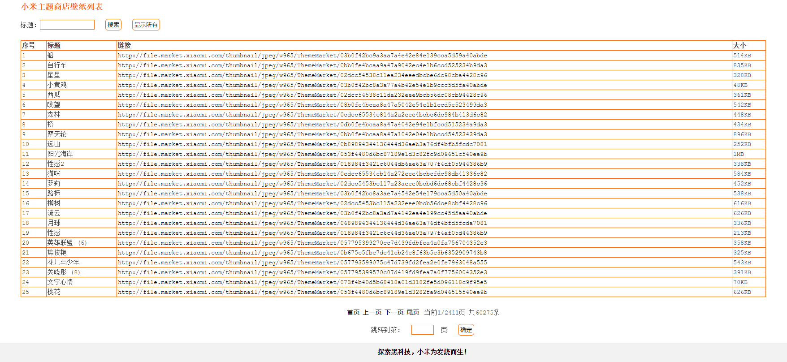

# python爬虫数据保存到数据库并展示

python从网上爬取数据后结果保存到文本文件中，然后从文本文件导入到mysql数据库中，最后用php展示出来。

## 1. pathon爬虫文件 spider.py

## 2. 创建mysql数据库和表 createdb.sql createtable.sql

## 3. 展示表格文件 index.php (自带css样式)

## 4. 展示缩略图文件 thumb.php(自带css样式)

## 5. 表格展示结果截图

## 6. 缩略图展示结果截图

